# Project 6: NodeJS-Authentication-System

## Cách chạy
Cài đặt dependencies:
```bash
npm install
npm npm install axios
```

Chạy server:
```bash
node app.js
```

## Các trang & chức năng

### 1. Signup (/user/signup)
- Giao diện signup hiển thị  
  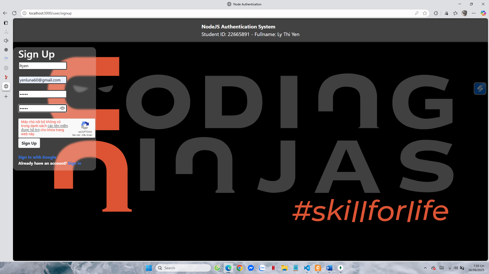  
- Không tick captcha → lỗi  
  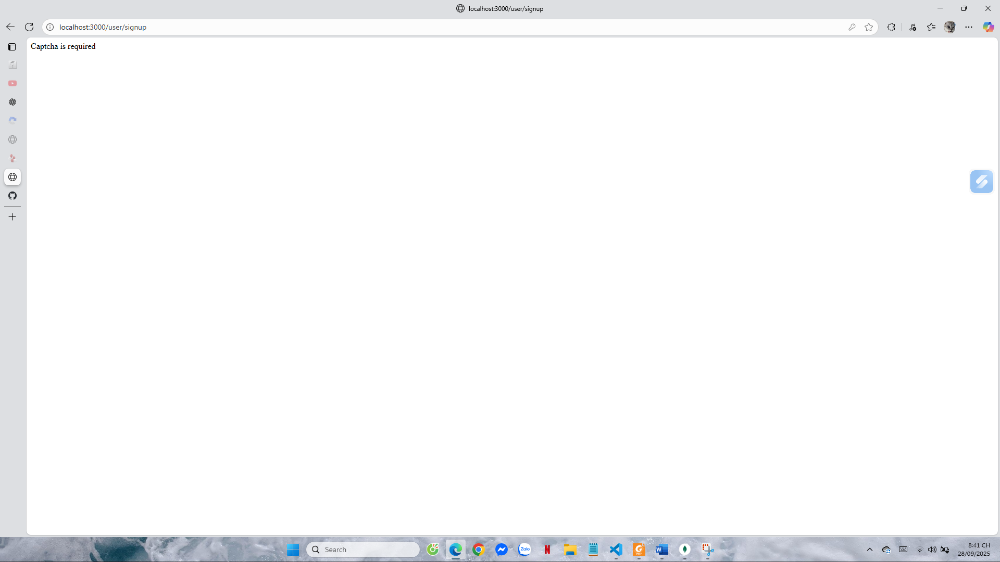  
- Tick captcha + nhập đúng → đăng ký thành công  
    
- MongoDB có user mới  
  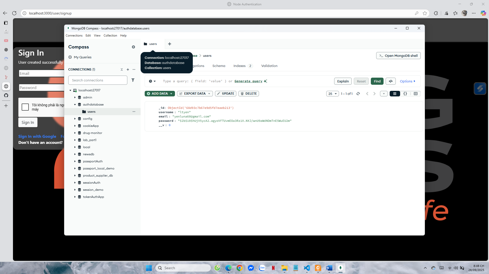  

---

### 2. Signin (/user/signin)
- Giao diện signin hiển thị  
  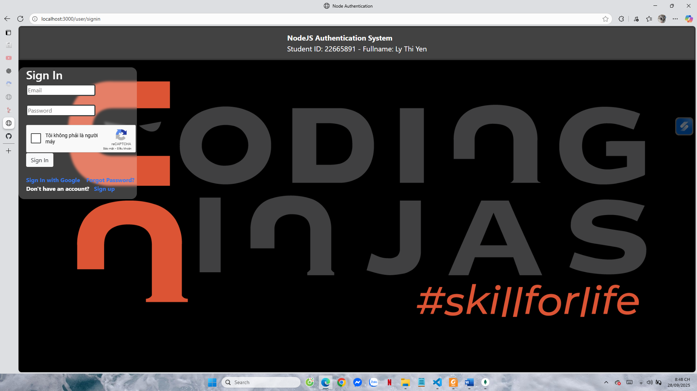  
- Sai email/password → lỗi  
    
- Đúng email/password → login thành công  
  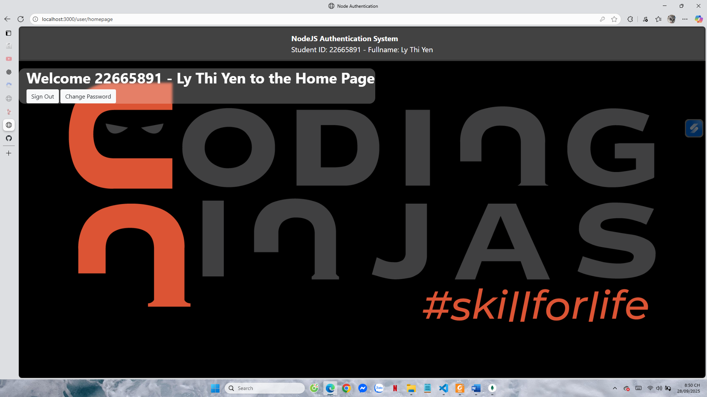  

---

### 3. Homepage (/homepage)
- Chưa login → redirect signin  
  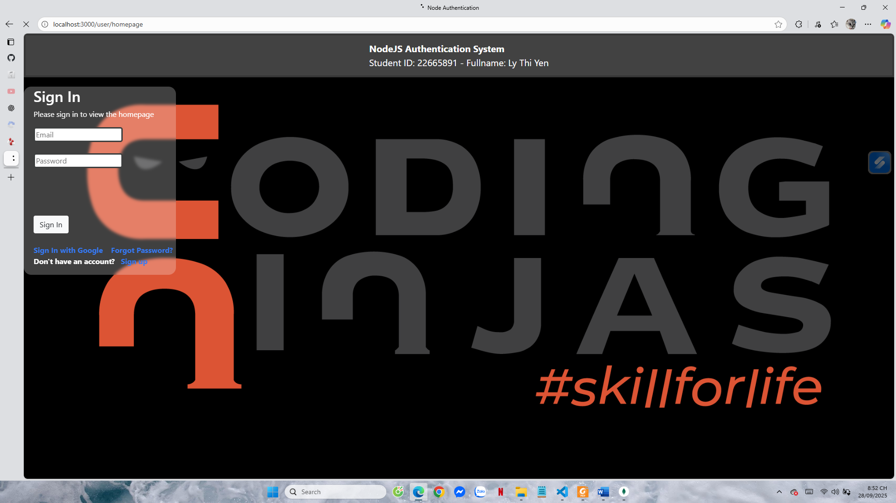  
- Đã login → hiển thị user + Student ID + Fullname  
    

---

### 4. Logout (/user/signout)
- Logout thành công  
    

---

### 5. Forgot Password (/user/forgot-password)
- Giao diện forgot password  
  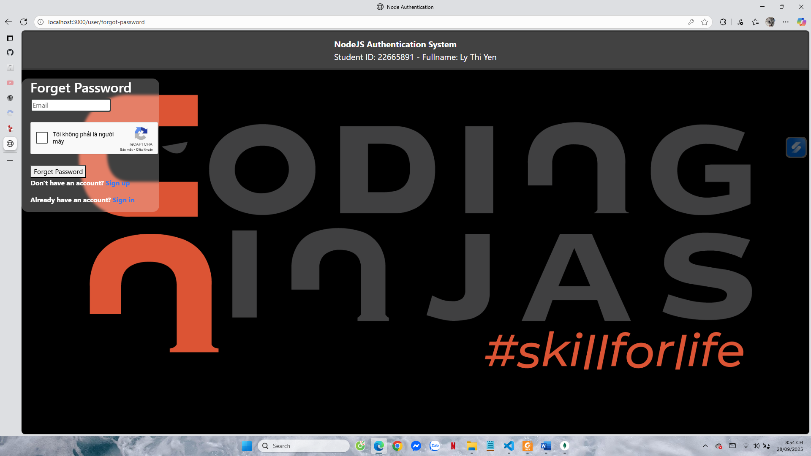  
- Email không tồn tại → lỗi  
  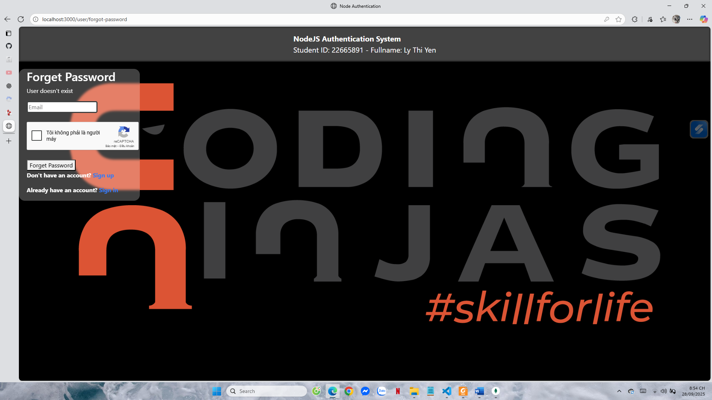  
- Email hợp lệ → gửi mail reset thành công  
  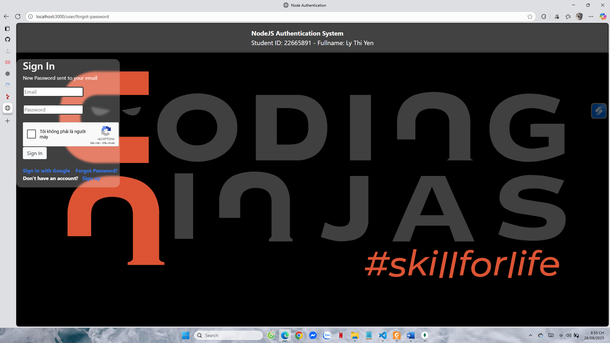  
---

### 6. Reset Password (/user/change-password)
- Token không hợp lệ/hết hạn → lỗi  
  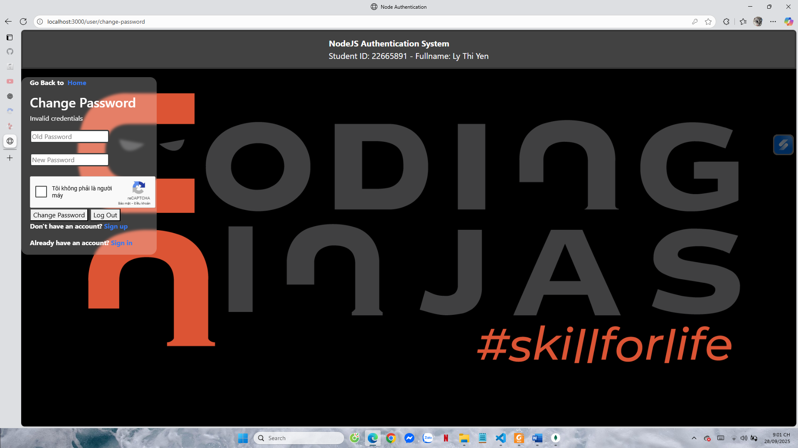  
- Token hợp lệ (từ email) → đổi password thành công  
    


---

### 7. Google OAuth Login (/auth/google)
- Click login with Google → Google popup  
  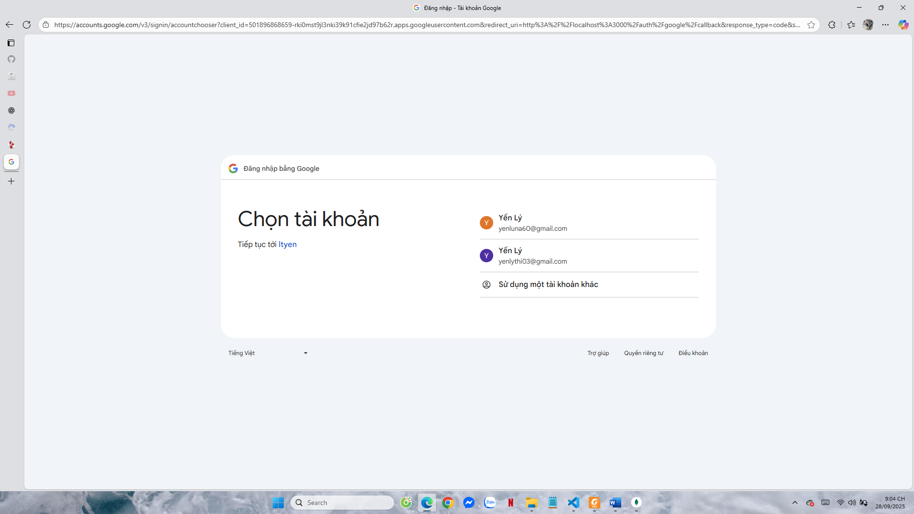  
- Config đúng → login thành công  
  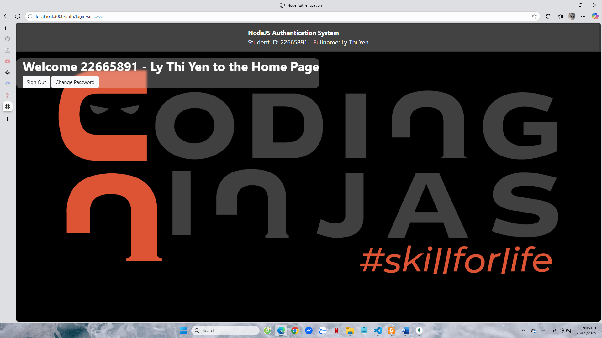  

---

### 8. Captcha
- Không tick captcha → signup thất bại  
    
- Tick captcha → signup thành công  
    

---

### 9. MongoDB kiểm tra
- User tạo mới  
     

---

## Hoàn thành
- Đã test tất cả các trang theo chức năng.  
- Ảnh minh họa lưu trong `public/results/`.  
